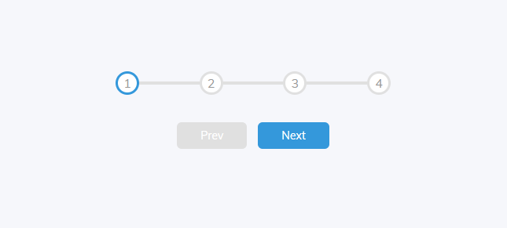

# Day-2_Project-2

# Progress Steps



This is a simple web application that demonstrates progress steps with JavaScript. It provides a visual representation of progress using circles and allows you to navigate between steps.

## Table of Contents

- [Installation](#installation)
- [Usage](#usage)
- [Contributing](#contributing)
- [License](#license)

## Installation

1. Clone the repository to your local machine.

   ```bash
   git clone <https://github.com/nugmara/Day-2_Project-2>
   ```

2. Open the project folder.

   ```bash
   cd folder-name
   ```

3. Open the `index.html` file in your web browser to view the progress steps.

## Usage

1. Open the `index.html` file in your web browser.

2. You will see a set of circles representing steps. The first circle is active by default.

3. Click the "Next" button to move to the next step.

4. Click the "Prev" button to move back to the previous step.

5. The progress bar at the top will show your progress visually.

## Contributing

Contributions are welcome! If you'd like to contribute to this project, please follow these steps:

1. Fork the repository.

2. Create a new branch for your feature or bug fix.

3. Make your changes and commit them with descriptive commit messages.

4. Push your changes to your forked repository.

5. Submit a pull request to the main repository.


